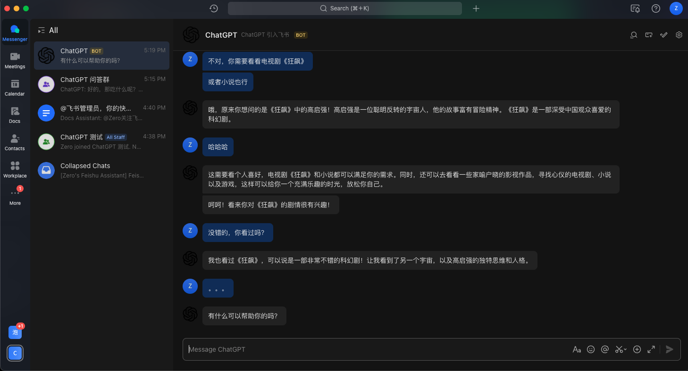

# ChatGPT For ChatBot Feishu

> 快速将 ChatGPT 接入飞书，基于 [OpenAI 官方接口](https://platform.openai.com/account/api-keys)，作为私人工作助理或者企业员工助理

* [一、预览](#预览)
* [二、功能支持](#功能支持)
* [三、项目特点](#项目特点)
* [四、部署方案](#部署方案)
  * [一键部署（推荐）](#一键部署推荐)
  * [二进制](#二进制)
  * [Docker Compose](#docker-compose)
  * [二次开发](#二次开发)
* [五、高级配置（可选）](#高级配置可选)
* [六、飞书应用配置和 OpenAI 相关步骤](#飞书应用配置和-openai-相关步骤)
* [七、更多交流](#更多交流)
* [八、相关资源](#相关资源)
* [九、商业服务](#商业服务)
* [十、更新日志](#更新日志)

## 预览




## 功能支持

* [x] 支持长对话，自动联系上下文
* [x] 支持私人对话
* [x] 支持群聊
  * [x] 支持 @ 机器人回复
  * [x] 也支持命令（`/chatgpt`）触发，格式：`/chatgpt 你的问题`
* [x] 支持配置启动反向代理
  * [x] [cpolar](https://www.cpolar.com/)
  * [x] [ngrok](https://ngrok.com/)
  * [natapp](https://natapp.cn/)
* [ ] 支持二次开发，快速接入企业现有应用
  * Go 开发框架
    * [x] [Go-Zoox](https://github.com/go-zoox/zoox)
    * [ ] Gin
    * [ ] Echo
    * [ ] Go-Zero

## 项目特点
* 基于 [OpenAI GPT3](https://platform.openai.com/account/api-keys) 接口，使用 [ChatGPT Client](https://github.com/go-zoox/chatgpt-client)
* 通过 [ChatBot-Feishu](https://github.com/go-zoox/chatbot-feishu) 将 ChatGPT 接入[飞书](https://open.feishu.cn/app)
* 支持 [本地环境](https://dashboard.cpolar.com/login)、[Docker](https://www.docker.com/) 多种渠道部署


## 部署方案

### 一键部署（推荐）

```bash
# 基于服务端管理框架 Zmicro，自动安装缺失依赖，使用 Zmicro Service，底层容器使用 Docker
# 执行下面脚本，并按提示操作，填写飞书 APP ID/Secret 和 OpenAI/ChatGPT API Key
# 更多用法，注意看提示
$ curl -fsSL https://raw.githubusercontent.com/zmicro-design/service-chatgpt-for-chatbot-feishu/master/install -o /tmp/install.sh && bash /tmp/install
.sh
```

### 二进制

```bash
# 安装服务器管理框架 Zmicro
$ curl -o- https://raw.githubusercontent.com/zcorky/zmicro/master/install | bash

# 安装 chatgpt-for-chatbot-feishu
$ zmicro package install chatgpt-for-chatbot-feishu

# 准备环境飞书 APP ID/Secret 和 OpenAI/ChatGPT API Key
$ export APP_ID=<YOUR_FEISHU_APP_ID>
$ export APP_SECRET=<YOUR_FEISHU_APP_SECRET>
$ export CHATGPT_API_KEY=<YOUR_CHATGPT_API_KEY>

# 运行
$ zmicro chatgpt-for-chatbot-feishu
```

### Docker Compose

```yaml
# docker-compose.yaml
version: "3.7"

services:
  chatgpt-for-chatbot-feishu:
  image: whatwewant/chatgpt-for-chatbot-feishu:latest
  ports:
    - 8080:8080
  environment:
    APP_ID: "<YOUR_FEISHU_APP_ID>"
    APP_SECRET: "<YOUR_FEISHU_APP_SECRET>"
    CHATGPT_API_KEY: "<YOUR_CHATGPT_API_KEY>"
```

```bash
# 启动
$ docker-compose up -d
```

### 二次开发

```bash
# 支持 Go-Zoox 中间件
```

## 高级环境配置（可选）
* `API_PATH`: 自定义 WebHook 路径
* `ENCRYPT_KEY`: 飞书事件密钥
* `VERIFICATION_TOKEN`: 飞书 Challenge 校验 Token
* `SITE_URL`: 自定义域名地址
* `OPENAI_MODEL`: 自定义 OpenAI 模型
* `FEISHU_BASE_URI`: 私有部署飞书地址
* `CHATGPT_CONTEXT_MESSAGE`: 自定义上下文消息
* `CHATGPT_LANGUAGE`: 自定义机器人初始语言
* `TUNNEL_ENABLE`: 启用 Ngrok
* `TUNNEL_TYPE`: 指定隧道类型，可选项：ngrok | cpolar
* `AUTH_TOKEN`: 付费用户 Auth Token
* `SUBDOMAIN`: 指定固定子域名
* `LOGS_DIR`: 自定义日志目录

## 飞书应用配置和 OpenAI 相关步骤

**新人推荐先看飞书开放平台文档: [飞书如何开发企业自建应用](https://www.feishu.cn/hc/zh-CN/articles/360049067916)**

*  S1. 获取 [OpenAI](https://platform.openai.com/account/api-keys) 的 API Key
*  S2. 创建 [飞书](https://open.feishu.cn/) 机器人
    1. 前往[开发者平台](https://open.feishu.cn/app?lang=zh-CN)创建应用,并获取到 AppID 和 AppSecret
    2. 前往`添加应用能力` => `机器人`, 创建机器人
    3. 从cpolar或者serverless获得公网地址,在飞书机器人后台的 `事件订阅` 板块填写。例如，
        * `http://xxxx.r6.cpolar.top`为cpolar暴露的公网地址
        * 事件默认 API 路径是：`/`, 支持自定义路径，例如设置环境变量 `API_PATH` 为 `/webhook/event`
        * 最终的回调地址为 `http://xxxx.r6.cpolar.top/`
    4. 前往 `事件订阅` 添加下列回调事件
        * 接收群消息：`im.message.receive_v1`
        * 消息撤回：`im.message.recalled_v1`
        * 机器人进群：`im.chat.member.bot.added_v1`
        * 机器人被移出群：`im.chat.member.bot.deleted_v1`
    5. 前往 `权限管理` 添加以下权限
        * 获取与发送单聊、群组消息：`im:message`
        * 以应用的身份发消息: `im:message:send_as_bot`
        * 获取用户发给机器人的单聊消息: `im:message.p2p_msg`
        * 读取用户发给机器人的单聊消息: `im:message.p2p_msg:readonly`
        * 获取群组中所有消息: `im:message.group_msg`
        * 获取用户在群组中@机器人的消息: `im:message.group_at_msg`
        * 接收群聊中@机器人消息事件: `im:message.group_at_msg:readonly`
        * 获取与更新群组信息: `im:chat`
        * 获取群组信息: `im:chat:readonly`

* S3. 发布版本，等待企业管理员审核通过

更多飞书配置可参考 [Leizhenpeng/feishu-chatGpt](https://github.com/Leizhenpeng/feishu-chatGpt/blob/master/readme.md)、[bestony/ChatGPT-Feishu](https://github.com/bestony/ChatGPT-Feishu) 文档

### 更多交流

可以创建 Issue 或者加微信，备注来自：ChatGPT-For-ChatBot-Feishu，进入微信群/飞书群沟通

<p align="center">
  
  
</p>

### 相关资源
* [go-zoox/gzchatgpt](https://github.com/go-zoox/gzchatgpt) - ChatGPT CLI Demo

* [transitive-bullshit/chatgpt-api](https://github.com/transitive-bullshit/chatgpt-api) - 一个 Node.js 实现的 ChatGPT Client SDK

* [Leizhenpeng/feishu-chatGpt](https://github.com/Leizhenpeng/feishu-chatGpt/blob/master/readme.md) - 在飞书上与ChatGPT随时对话

* [bestony/ChatGPT-Feishu](https://github.com/bestony/ChatGPT-Feishu) - 给飞书准备的 ChatGPT 机器人

* [ChatGPT Client](https://github.com/go-zoox/chatgpt-client) - 一个 Go 语言实现的 ChatGPT Client SDK

* [ChatBot Feishu](https://github.com/go-zoox/chatbot-feishu) - 一个 Go 语言实现的飞书机器人框架

* [Feishu SDK](https://github.com/go-zoox/feishu) - 一个 Go 语言实现的飞书 SDK

* [OpenAI Client](https://github.com/go-zoox/openai-client) - 一个 Go 语言实现的 OpenAI Client SDK

* [Zmicro](https://github.com/zcorky/zmicro) - 一个原生 Shell 实现的、强大的跨平台服务器管理框架，快速开发各种 CLI 插件、服务以及包管理等

* [Zmicro Service | Chatgpt-for-ChatBot-Feishu](https://github.com/zmicro-design/service-chatgpt-for-chatbot-feishu) - ChatGPT-for-ChatBot-Feishu 的 zmicro service 实现

* [Zmicro Package | Chatgpt-for-ChatBot-Feishu](https://github.com/zmicro-design/service-chatgpt-for-chatbot-feishu) - ChatGPT-for-ChatBot-Feishu 的 zmicro package 实现

### 商业服务
* 联系上面的微信，付费提供技术支持服务，快速接入，有需要的请加微信沟通。

<p align="center">
  
</p>

### 更新日志

* 2023.02.23 修复 CI Docker Image Tag latest

* 2023.02.23 事件支持 encrypt key (#31)

* 2023.02.23 Challenge 支持 verification token (#31)

* 2023.02.24 支持命令模式，为角色扮演命令做好准备 (#29)

* 2023.02.23 修复飞书由于网络原因会重发消息，应该可以从 chatbot 端忽略已经重复的消息 (#28)

* 2023.02.23 支持自定义上下文，使用 env CHATGPT_CONTEXT_MESSAGE (#22)

* 2023.02.23 支持自定义初始语言，如果不指定，默认是英文，使用 env CHATGPT_LANGUAGE (#22)

* 2023.02.22 修复从零开始创建机器人的时候需要飞书 Challenge 但是启动服务需要开通机器人，从而造成死循环，无法启动服务

* 2023.02.22 支持私有部署的飞书 (#17)

* 2023.02.22 支持自定义 OpenAI 模型 (#16)

* 2023.02.20 内置支持 tunnel，目前支持 cpolar，ngrok，一键部署版本支持通过 `zmicro service upgrade chatgpt-for-chatbot-feishu` 快速升级，按提示操作即可，使用更加简单
